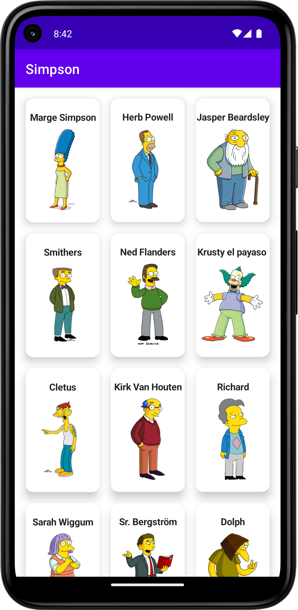
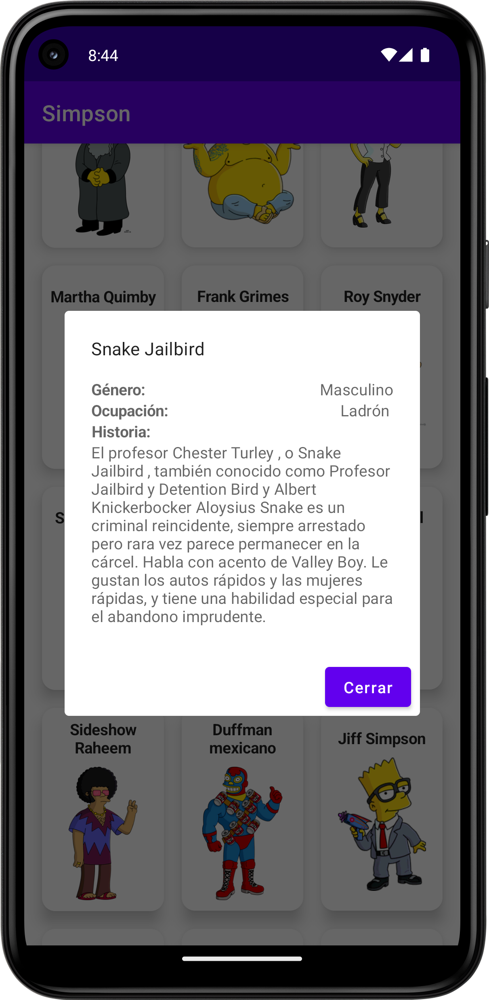

# Challenge App

This is an app I developed for a coding challenge.

## Overview

The app is built using Kotlin programming language and follows the MVVM (Model-View-ViewModel) architecture pattern. It utilizes Jetpack Compose for building the user interface, which provides a modern and declarative way of creating UI components.

## Features

The app includes the following features:

- Character Grid: Displays a grid of characters from The Simpsons, including their photo and name.
- Character Details: When a character is clicked, a modal is displayed with a brief history of the character.

## Libraries and Dependencies

The following libraries and dependencies were used in the development of this app:

- Jetpack Compose: A modern toolkit for building native Android UI.
- Retrofit: A type-safe HTTP client for making network requests.
- Glide: An image loading and caching library for Android.
- Dagger: A dependency injection framework for building scalable and maintainable applications.

## Getting Started

To build and run the app locally, follow these steps:

1. Clone this repository: `git clone https://github.com/emifra9/simpson-compose.git`
2. Open the project in Android Studio.
3. Build the project.
4. Run the app on an emulator or a physical device.

## Snapshots

